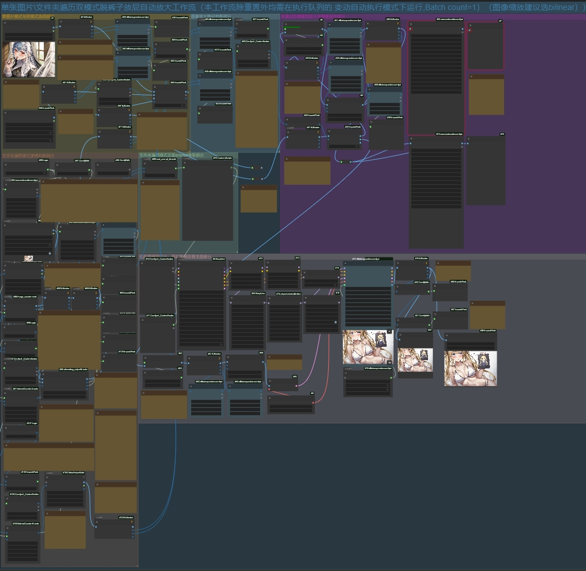

# Automatic-workflows-for-Comfy

此为由于不想天天看码，所以突发奇想把后端功能搬前端干的单图片\文件夹自动遍历双模式自动4K分辨率放大脱裤子放屁工作流。在工作流运行完之后，一张大小为1024x1536的图片可以以最小的损耗自动放大3次（前两次放大1.5倍，最后一次放大2倍）到4608x6912（超4k接近6k）的大小。而其中每次放大的倍数与所选取的放大模型与放大方法均可调！

工作流导入方法：将github项目内的automatic upscaling workflow v1（by GHOSTLXH）.json文件导入到ComfyUI中或之间把下面这张图像拖入ComfyUI中即可！

1：
除开新增节点外本工作流还需要的前置节点\节点包（如果还没下载的话建议先使用ComfyManager进行下载）：KJNodes、efficiency-nodes-comfyui、Impact-Pack、Comfyroll_CustiomNodes、was-node-suite-comfyui、Custom-Scripts、ComfyMath、Logic、VideoHelperSuite、Easy-Use、sd-perturbed-attention、

工作流新增的节点包（虽然节点包有6个节点，但在本工作流中只用了5个，你可以发挥你的想象和创造力发明更多其他的用法）：https://github.com/GHOSTLXH/ComfyUI-Counternodes/tree/main 

节点导入方法：将https://github.com/GHOSTLXH/ComfyUI-Counternodes/tree/main 中的6个节点文件夹全部复制黏贴到ComfyUI的Custom_nodes文件夹内即可使用。

我的lora与其他模型（大爷有空过来玩啊QAQ求求你了求求你了><）：https://civitai.com/user/ghostlxh

（loras and other models）（Come and have a visit please QAQ）

工作流整体概览 whole workflow preview

2：节点运行前你需要准备的：

单图片模式：1、你要放大的图片 2、一张大小为512x512的空白png图像

文件夹遍历模式：1、你要放大的图片 2、与图片同名的，内含该图片对应的正面prompt的txt文本文件 3、一张大小为512x512的空白png图像

注1：在每次工作流文件夹遍历模式开启之前都应先重置一次工作流并检查图像接受和发送节点的链接ID是否相同！（单张图片模式的话将图像接收节点切换回512x512大小的空白图像即可）

3、工作流模式切换方法（默认为文件夹遍历模式）：

从文件夹遍历模式切换至单张图片模式：
（1）：将扩散模型加载器的正面提示词输入由上方与Load prompt from TXT节点相连的展示文本节点换回下图节点10的文本输入节点并在其中输入目标图像对应的正面prompt（负面prompt保持不变，如果此模块改为FLUX的话就只用换正面prompt即可）

（2）：将图像放大路径判断模块的节点35整数运算节点由原先的，与遍历文件夹逻辑判断模块右下方的节点102 获取图像尺寸数量节点相连改为与单图像放大模式中的节点2的 获取图像尺寸数量节点的宽高相连。

（3）：将工作流中间已经与右侧的单纯后期模型放大模块中的节点51获取图像尺寸数量节点连接，来自节点71获取图像尺寸数量节点的（文件夹遍历模式）转接点（即下面的转接点）改为使用上方的来自来自节点47获取图像尺寸数量节点的（单张图片放大模式）转接点与单纯后期模型放大模块中的节点51获取图像尺寸数量节点相连接。

4：重置步骤与启动方法：

单张图片模式：

（1）、将图像接收节点内图像换回512x512大小的空白图像并检查图像接收与发送节点的连接ID是否相同

（2）、检查节点1加载图像节点内加载的图像是否为目标图片

（3）、在节点10与11的文本节点中输入目标图像对应的正面\负面prompt

（4）、将队列执行模式改回 自动执行（变动）模式，Batch count=1后点击执行队列即可开始自动放大。

文件夹遍历模式：

（1）、将左上的布尔值由false改为true、正上方的“整数到数字”节点值由0（非重置）改为1（重置）

（2）、将图像接收节点内图像换回512x512大小的空白图像并检查图像接收与发送节点的连接ID是否相同

（3）、在节点80和104的加载图像（路径）节点与104的Load prompt from TXT节点的路径输入栏中输入按格式（以一张图片和与它同名的、包含该图片的正面prompt的txt文件为一个单位）排好图片与txt文件的文件夹绝对路径。

（4）、在 自动执行 禁用（禁用！！！），即单次执行模式下执行一次工作流，在工作流运行到“图像通过模型放大”节点时即可停止工作流运行（即删除此运行任务），从而完成逻辑判断部分的重置。此时可通过检视下方输出日志节点输出的数字来确认。在默认状态下，这7个输出日志的输出数字由上至下应为：特定文件夹内第一张图片的宽、第一张图片的高、0、0、0、0、任意数字（这个数字在后面真正第一轮运行时也会变为0）

（5）、将左上布尔值改回false，正上方的“整数到数字”节点值由1（重置）改回0（非重置）后，将队列执行模式改回 自动执行（变动）模式，Batch count=1后点击执行队列即可开始自动遍历放大（在按程序遍历完文件夹内所有图片后本工作流会直接报错从而停止工作流执行，此时将自动执行改回禁用即可停止队列继续执行）

注3：此节点的扩散模型辅助放大模块也可更换为flux等其他扩散模型的图生图流程，在图片进行放大前也可连接诸如面部、手部修复工作流，或者是指定第一轮先由flux放大，第二轮再选用其他模型放大（甚至是自回归模型），亦或是将放大工作流改为其他诸如蒙版切换、风格迁移的工作流......而你要做的仅是视情况对各节点的输出轮数进行更改与将遍历模块与对应的工作流连接起来即可，而Alternating output的输出顺序和输入图片数量也可在节点代码层面进行更改，此处仅是抛砖引玉，你可以拿这个遍历模块干很多有趣的事情！！！（前提是你已经充分了解本工作流的工作流程并且做好备份！！！不然出错了跑不动是你自己的问题）

5：工作流整体逻辑：
单张图片模式（单个循环）： 图片加载并获取大小-进行第一次大小对比-输出图片-进行第二次大小对比并决定放大路径（未到目标放大分辨率）-后期模型辅助扩散模型进行i2i放大-回传图片-与原图进行大小对比-输出图片-进行大小对比决定放大路径（未到目标放大分辨率）-后期模型辅助扩散模型进行i2i放大-回传图片-进行大小对比-输出图片-进行大小对比决定放大路径（到达或超过目标放大分辨率）-单纯后期模型放大-保存图像 

文件夹遍历模式（前3张图片（循环））：
第一张图片与对应prompt加载并获取大小，同时获取第一张图片的目标放大分辨率-进行大小对比-（单张图片模式的整个循环）-保存第一张图像-加载第二张图片与对应prompt加载并获取大小，同时获取第二张图片的目标放大分辨率-（单张图片模式的整个循环）-保存第二张图像-加载第三张图片与对应prompt加载并获取大小，同时获取第一张图片的目标放大分辨率-（单张图片模式的整个循环）-保存第三张图像-.......-保存最后一张图像-文件夹里已没有图片-工作流报错，强制停止工作流执行

